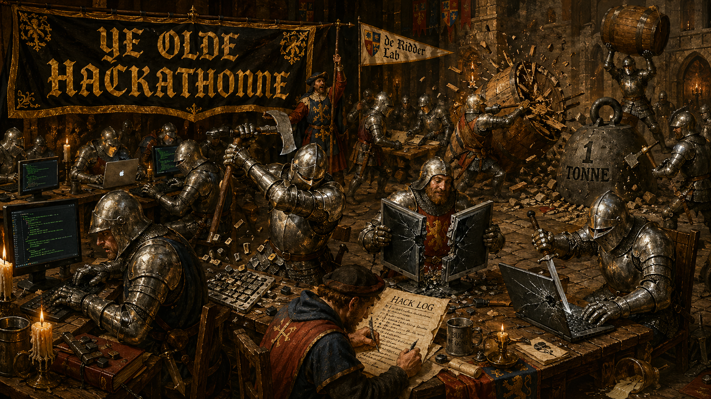
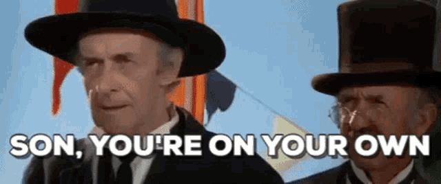

<div align="center">
  
  <figcaption>Fig 1. Obligatory AI-generated diagram to add spirit and vim to this README.
  Motivational quote: 'Hack away'! Hotel: Trivago.</figcaption>
</div>


# Ridder Lab AI Hackathon — Spring 2026 Retreat

Welcome. This folder is the playground for the lab retreat. Each team picks an automation idea, hacks on it for the duration of the retreat, and ships their work into `submissions/team_<your_name>/`. Refer to the [brainstorm idea doc](./BRAINSTORM_lab_automation_ideas.md) to find ideas that we pre-generated and the ideas that we have just come up with.

The brainstorm document has more details, but TL;DR the hackathon:
1. You clone this repo (ideally the top-level ridder_lab_ai_automation repo if you want context for any AI coding agents)
2. You work with your team in a folder within `submissions`, e.g. `submissions/Spanish_are_best_team_NO_CUBANS` or something similarly innocuous.
3. You produce i) a markdown document detailing exactly: a) the problem you intend to solve; b) why that is a problem and how LLM agents or other automation could solve this (partly); c) a proposed architecture/workflow/idea of how to implement this; d) any references or tool docs that could be useful for further work. ; ii) an initial implementation, in so far as you can get that in ±50 minutes with the help of your teammates and your LLM bot of choice.
4. Starting sources on LLM reviews, scientific agent/AI workflows, tools, etc. can be found in [additional_information_and_resources](./additional_information_and_resources). These are almost certainly relevant, so add them to any LLM chats or agents and ask if there's anything in there.

Note that it's good to check that we're not reinventing the wheel, so if there are tools that we should just start using given the ideas in the [brainstorm idea doc](./BRAINSTORM_lab_automation_ideas.md), this is great:  write-up on what to use, how, and where is also useful! Something you should think about: is the solution something we will run on our local laptops, is it something we will run on the hpc (e.g. code analysis, but no internet access allowed because that's a security nightmare), or something that will interact with Slack (and should perhaps live as a bot on a cloud VM)? Note this in the document. 

## 10-minute start

```bash
# 1. Clone the parent monorepo so you also get the building blocks and the
#    live slack paperbot as reference. Skip the --recurse-submodules flag
#    if you only want the hackathon.
git clone --recurse-submodules https://github.com/DieStok/ridder_lab_ai_automation.git
cd ridder_lab_ai_automation/hackathon

# 2. Sync the shared dev environment. This installs every common dependency
#    (Slack, LLM clients, LangGraph, web/PDF parsing, data tools) into a
#    single .venv at hackathon/.venv. uv handles caching so this is fast
#    after the first run.
#    NOTE: you can of course get started researching without this. This is only for implementation!
uv sync

# 3. Pick a problem from BRAINSTORM_lab_automation_ideas.md

# 4. Make your team's working directory.
git checkout -b team/<your_team>
mkdir submissions/team_<your_team>
cp submissions/TEMPLATE.md submissions/team_<your_team>/PROPOSAL.md
cd submissions/team_<your_team>

# 5. (a) If you're building a Slack bot:
cp -r ../../../automation_building_blocks/slack_app_skeleton/* .
cp .env.example .env       # then fill in your tokens
# Note: slack_app_skeleton has its own pyproject.toml. You can either
# `uv sync` inside your submission for an isolated venv, or — for the
# retreat — just use the shared hackathon/.venv at the parent level
# and skip your own pyproject.

# 5. (b) If you're building something else:
uv init                    # fresh pyproject in your team dir
# ... or just write Python files and use the shared hackathon/.venv

# 6. Iterate with your coding agent. Push your branch when you have
#    something to share.
git add .
git commit -m "[team_<your_team>] first cut"
git push origin team/<your_team>
```

## Ground rules

1. **No force-pushes to `main`.** Work on `team/<your_team>` branches. 
2. **Don't touch other teams' folders.** Stay inside `submissions/team_<your_team>/`. The shared hackathon-level files (`README.md`, `pyproject.toml`, `BRAINSTORM_lab_automation_ideas.md`, `AGENTS.md`) are also off-limits for in-place editing during the retreat — open an issue or PR if you want them changed.
3. **Have fun.** OR ELSE!

## What's already in this folder

```
hackathon/
├── README.md                                # this file
├── AGENTS.md                                # short, concrete rules for your coding agent
├── .claude/CLAUDE.md                        # symlink → AGENTS.md (for Claude Code)
├── BRAINSTORM_lab_automation_ideas.md       # seed ideas — pick one or invent your own
├── pyproject.toml                           # shared dependencies (uv-managed)
├── .env.example                             # baseline secrets schema
├── .gitignore
└── submissions/                             # one subdir per team
    └── README.md
```

## Starter resources

- **`automation_building_blocks/slack_app_skeleton/`** (in the parent monorepo) — minimal Slack Bolt app with Socket Mode. Easiest start for a Slack bot.
- **`automation_building_blocks/deployment_recipes/`** — how to run a tool locally, on HPC, on a VM.
- **`slack_paperbot_ridder_lab/`** (in the parent monorepo) — working paper FYI bot concept. Did use internet from the HPC, so decommissioned for now (thanks Roy, and apologies - Dieter) until refactor for running locally or on a cloud VM. 
- **`AGENTS.md`** — read this before pointing your coding agent at the repo. It tells the agent how to behave during the retreat.

## Submitting

Your team's work goes in `submissions/team_<your_team>/`. Push your branch:

```bash
git push origin team/<your_team>
```

At the end of the retreat, branches are merged into `main` so everyone's work is preserved in one place. If your work is unfinished, that's fine — push it anyway.

## Help

<div align="center">
  
  <figcaption>Fig 2. Nope. jk jk, we'll be perambulating and answering your queries with gusto.</figcaption>
</div>

