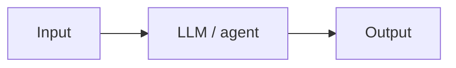

# <Team name> — <one-line title>

> Markdown syntax reminder: <https://www.markdownguide.org/cheat-sheet/>. Delete the hint blockquotes as you fill this in.

## 1. The problem

> What's the pain point? Who has it, how often?

## 2. Why it matters & where automation fits

> Cost of doing nothing. Which steps suit an LLM/agent, which stay human.

## 3. Architecture / workflow

> Where it runs, what the pieces are, how data flows. ASCII or mermaid diagram welcome. Note any existing tools you'd reuse — e.g. [LangGraph](https://github.com/langchain-ai/langgraph), [STORM](https://github.com/stanford-oval/storm).

ASCII example:

```
code committed today
        │
        ▼
sbatch GPU job (ollama)
        │
        ▼
qwen 3.6 27b — per-file code review
        │
        ▼
repo_path/code_reviews/daily_code_review_DDMMHHHH.md
        │
        ▼
ping in Slack
```

Mermaid example:



## 4. References

> Papers, docs, repos, Slack threads.

- [LangGraph](https://github.com/langchain-ai/langgraph)
- [STORM](https://github.com/stanford-oval/storm)
-

---

## (Bonus) Initial implementation notes

> Where the code lives, how to run it, what works vs. what's stubbed.
