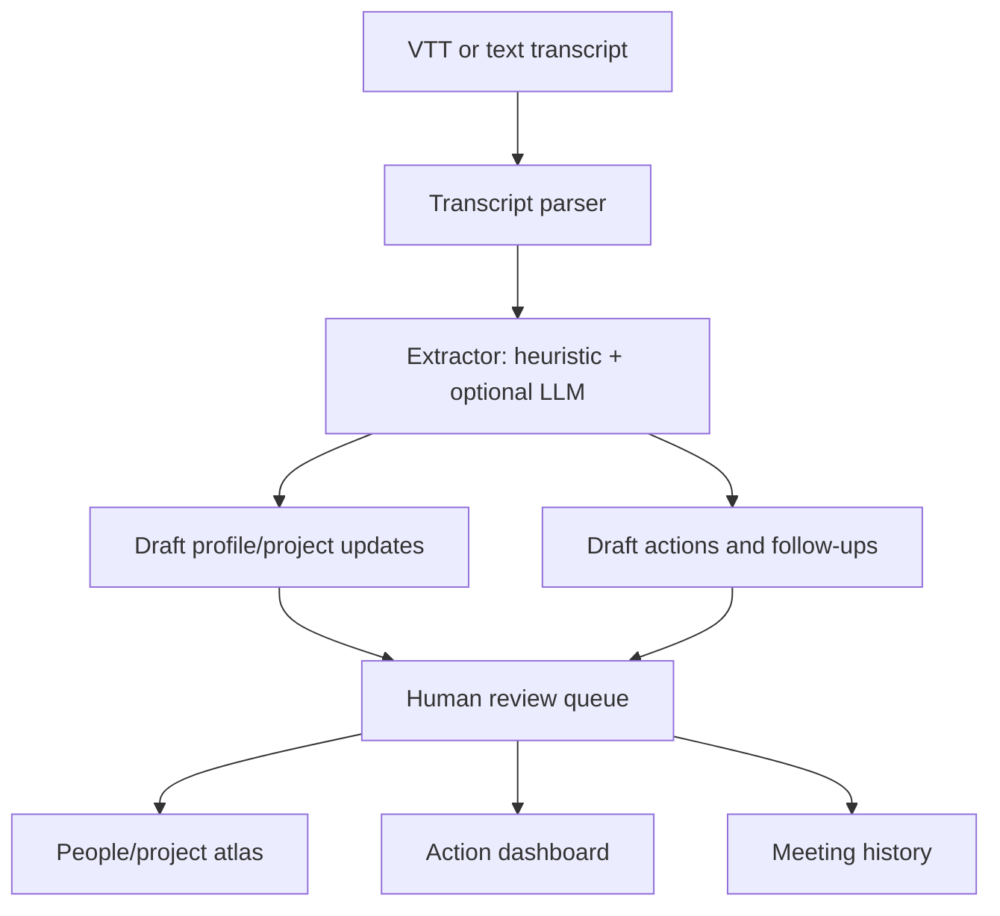

# lab_memory_atlas - De Ridder Lab Memory Atlas

## 1. The problem

The De Ridder Lab has many overlapping projects, SIGs, meetings, methods, and people. Useful context is created every week, but it often stays in transcripts, slides, private notes, or memory. Lab members can miss what was discussed, forget action items, repeat context, or fail to notice that someone nearby has relevant expertise.

## 2. Why it matters & where automation fits

The main need is not another meeting report. The useful product is a living internal map of people and projects: who is working on what, what changed recently, what is blocked, what should happen next, and who could help.

Automation fits as a first-pass extraction layer:

- identify meeting topics, decisions, action items, open questions, and challenges;
- propose updates to people and project pages;
- compare new transcripts against previous action items;
- prioritize follow-up ideas by importance, time, uncertainty, and risk/reward.

Humans stay in the loop for scientific correctness, privacy, and deciding what becomes lab-visible.

## 3. Architecture / workflow



The app is a local FastAPI + Jinja2 website. It stores state in JSON so the demo remains easy to inspect, edit, and move.

## 4. References

- De Ridder Lab website: <https://www.deridderlab.nl/>
- Hackathon ideas in `BRAINSTORM_lab_automation_ideas.md`, especially meeting transcription, SIG newsletter, lab-wide recent work summaries, and Jeroen-LLM/person matching.
- V1 prototype in `submissions/team_meeting_heros/`.

---

## (Bonus) Initial implementation notes

Run from `submissions/team_lab_memory_atlas/`:

```bash
uv sync
uv run uvicorn app:app --reload --port 8000
```

The first screen is the people/project map. Import a transcript from the Upload view, then approve draft updates from the Review Queue.
