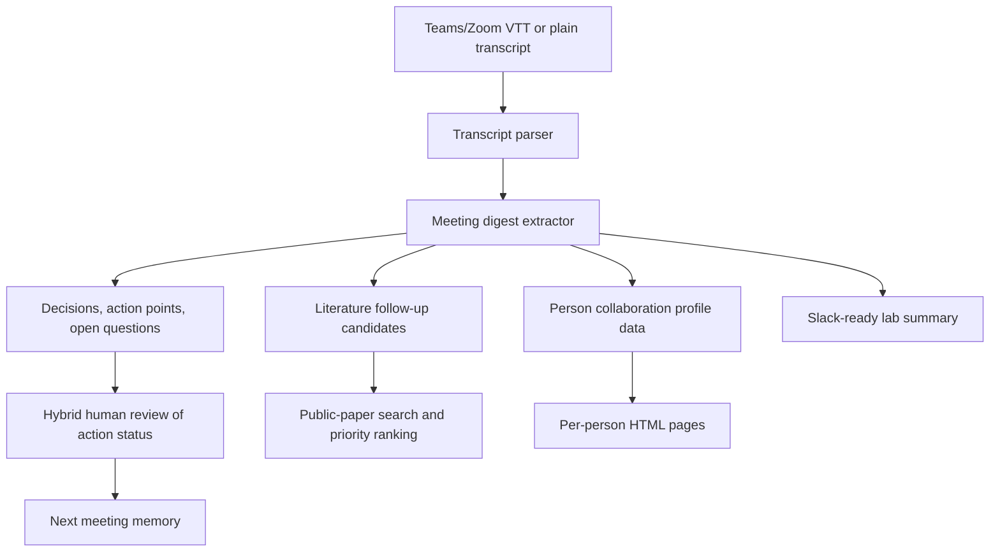

# meeting_heros - Meeting Memory for Scientific Labs

## 1. The problem

The De Ridder lab has many recurring meetings: weekly lab meetings with two presenters, SIG meetings for methylation, foundation models, and spatial transcriptomics, plus one-on-ones and project check-ins. Useful information is spread across transcripts, slides, chat messages, and people's memories. After a few weeks it becomes hard to know:

- what was decided;
- who promised to do what;
- whether previous action points were completed;
- which papers or methods should be read next;
- who in the lab is working on related ideas;
- what a presenter has done recently before they present to the whole lab.

The pain point is not only summarization. The real problem is that meetings create valuable lab context, but that context is not turned into durable, searchable, reusable institutional memory.

## 2. Why it matters & where automation fits

Without automation, the lab loses time re-explaining projects, repeating action items, missing useful collaborations across SIGs, and manually preparing meeting summaries. Busy postdocs and PhD students cannot attend every SIG, so they miss work that could help their own projects.

Automation fits well in the first-pass extraction and enrichment steps:

- parse transcripts into decisions, open questions, action points, and people;
- compare new meeting content against previous action points and propose whether they are done, blocked, or still unknown;
- extract literature follow-up questions and rank them by expected value, time needed, and risk/reward;
- update person-level collaboration profiles from meeting-derived evidence;
- draft a short Slack-ready lab update and a presenter-introduction snippet.

Humans stay in the loop for privacy, action-point status approval, scientific correctness, and deciding what gets shared lab-wide.

## 3. Architecture / workflow

Hackathon MVP: transcript-first, audio-ready.



### MVP behavior

The demo takes one transcript file and creates:

- `meeting_digest.md`: concise meeting summary, decisions, action points, literature ideas, and person notes;
- `meeting_memory.json`: structured data that later runs can use for action tracking;
- `slack_summary.md`: short lab-internal update ready to paste into Slack;
- `people/*.html`: one collaboration profile per detected speaker;
- `index.html`: simple navigation page for the generated meeting outputs.

### Production extension

For real deployment, audio would enter through a local transcription stack such as Whisper large-v3/v3-turbo, WhisperX, VibeVoice-ASR-HF, Meetily, or Whishper. The first production version should still store transcripts before running the LLM layer so outputs are auditable.

The likely running environment is a local lab workstation or lab-controlled VM. HPC is not the default if public web search or Slack delivery is enabled. For sensitive meetings, route summarization through a local LLM via `OLLAMA_BASE_URL`.

## 4. References

- Hackathon brainstorm ideas #2, #5, #9, and #12 in `BRAINSTORM_lab_automation_ideas.md`.
- `additional_information_and_resources/Teams_transcript_example/` for a Teams VTT transcript example.
- `additional_information_and_resources/claude_DR_automated_literature_surveys_local_RAG_local_Deep_Research_code_review_git_hygiene_meeting_transcription_enhancement_journal_clubs.md` for meeting transcription and journal-club pipeline recommendations.
- `useful_context/skill_bundles/idea2_meeting_transcription_summary_skills.zip` for meeting transcription and enrichment skill notes.
- `useful_context/skill_bundles/idea5_sig_newsletter_slack_skills.zip` for Slack-ready SIG newsletter patterns.
- Microsoft VibeVoice-ASR-HF: <https://github.com/microsoft/VibeVoice/blob/main/docs/vibevoice-asr.md>
- Meetily: <https://github.com/Zackriya-Solutions/meetily>
- Whishper: <https://github.com/pluja/whishper>
- WhisperX: <https://github.com/m-bain/whisperX>
- PaperQA2: <https://github.com/Future-House/paper-qa>
- Semantic Scholar API: <https://api.semanticscholar.org/api-docs/>
- PubMed E-utilities: <https://www.ncbi.nlm.nih.gov/books/NBK25501/>

---

## (Bonus) Initial implementation notes

The initial implementation is in `meeting_digest.py`. It is deliberately dependency-free so it can run during the retreat without modifying the shared hackathon environment.

Run from the hackathon repo root:

```bash
python3 submissions/team_meeting_heros/meeting_digest.py \
  additional_information_and_resources/Teams_transcript_example/Meeting\ Franka\ and\ Paul\ 20260501.vtt \
  --meeting-title "Meeting Franka and Paul" \
  --meeting-type "one_on_one" \
  --output submissions/team_meeting_heros/out/demo
```

What works now: VTT parsing, speaker extraction, heuristic meeting digest, draft action items, draft action-status comparison from a previous JSON file, literature-query suggestions, person collaboration pages, and Slack-ready output.

What is stubbed or future work: true LLM summarization, live audio transcription, real public-paper API calls, Slack posting, authentication, and persistent multi-meeting storage.
